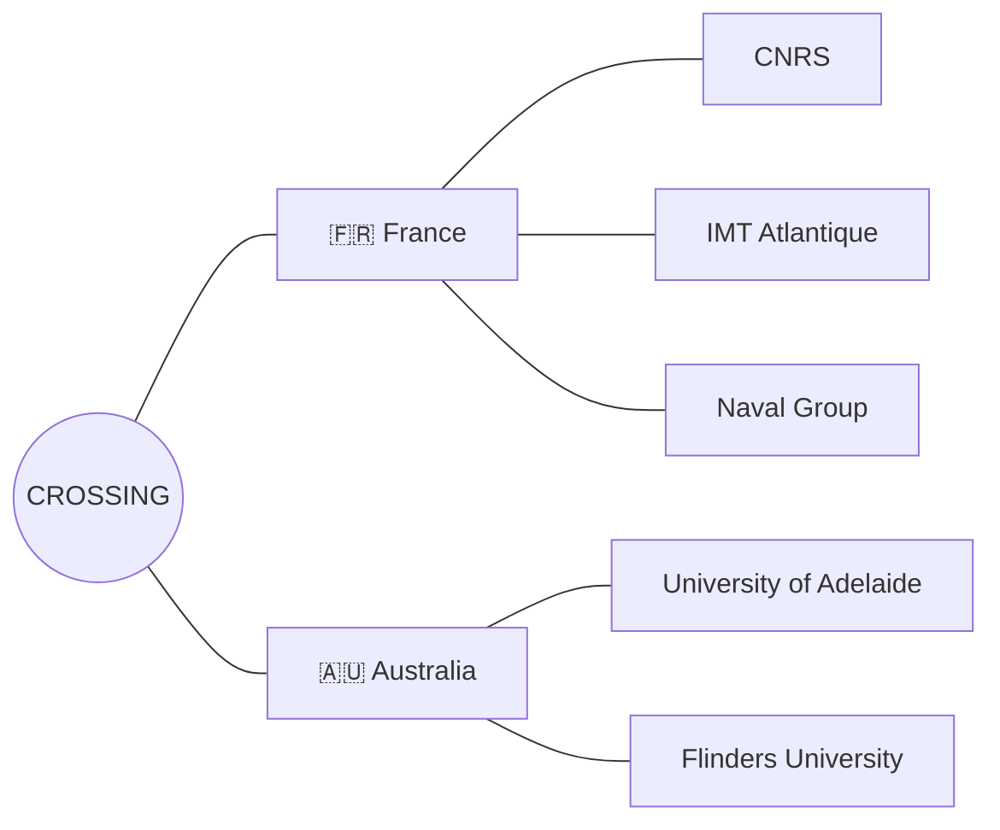
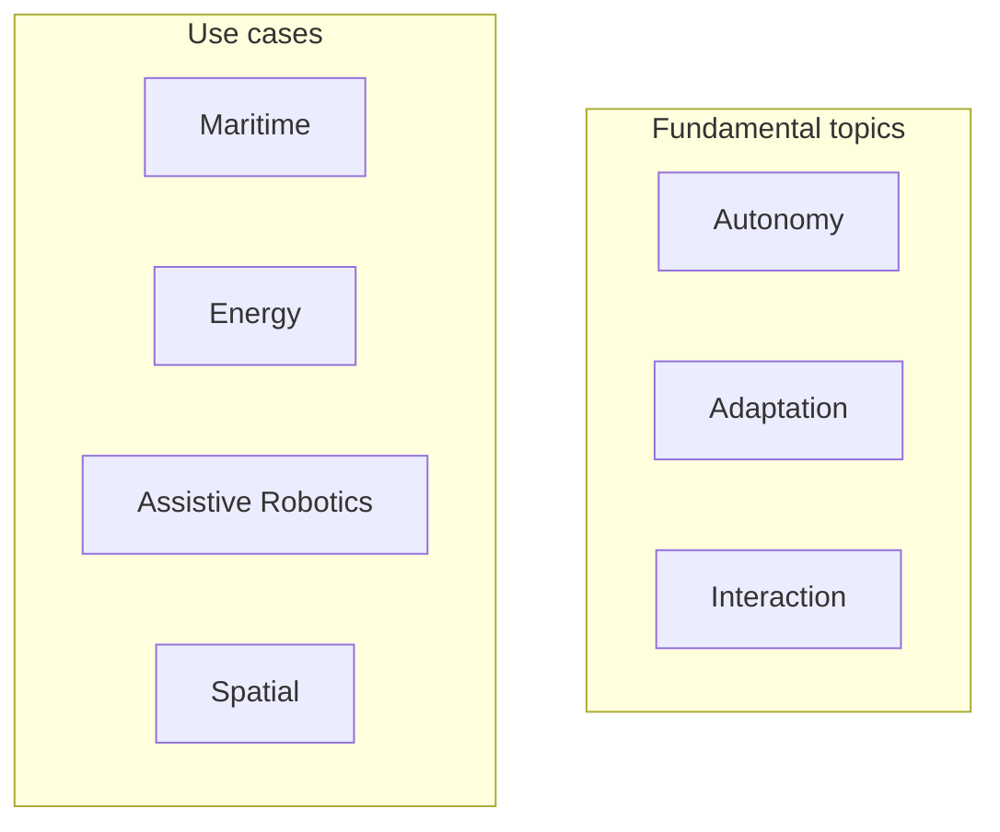

<picture>
  <source media="(prefers-color-scheme: dark)" srcset="https://raw.githubusercontent.com/IRL-Crossing-CNRS/.github/main/profile/assets/crossing-logo-dark.png">
  <source media="(prefers-color-scheme: light)" srcset="https://raw.githubusercontent.com/IRL-Crossing-CNRS/.github/main/profile/assets/crossing-logo-light.png">
  
</picture>

  

**International Research Laboratory (IRL) · CNRS**
 
French-Australian Laboratory for Human-Autonomous Agents Teaming

 

 

## About

CROSSING is a CNRS **International Research Laboratory (IRL)**, jointly operated with our Australian partners, dedicated to the study and design of **human-autonomous agent teaming**. Our researchers work across robotics, AI, human factors and systems engineering to build autonomous systems that can be trusted, understood and effectively teamed with by humans in complex, high-stakes environments.

 

## Partners

 

## Research

 

## Internships

CROSSING welcomes undergraduate and postgraduate interns for a minimum of **6 weeks**, with a stipend. New topics are posted on our website year-round — feel free to reach out and discuss a topic even if it isn't listed yet.

 

## Working with us

> **CROSSING members** — follow this organization to request access to our private repositories.

 

---

© 2026 CROSSING — CNRS International Research Laboratory · <a href="https://crossing.cnrs.fr/">crossing.cnrs.fr</a>

